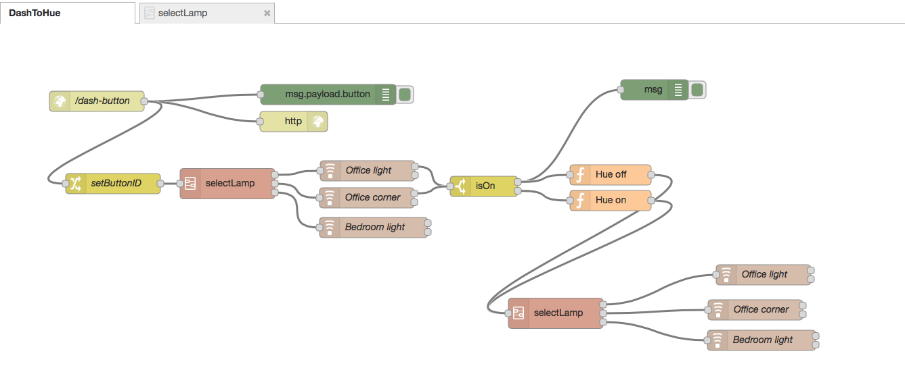

Dash2Hue
========

Control Hue lamps with Dash buttons

Overview
--------

There are two main components:

1.	The *dash_listener* Node.js script that catches the ARP requests from button presses and calls a web service

2.	A Node RED flow providing a web service that, when called, switches Hue lights on and off.

The whole setup can be run e.g. on a Raspberry Pi.

Installation
------------

### Prerequisites:

-	Node.js
-	Node RED v13.3 or higher
-	npm install node-dash-button
-	npm install node-red-contrib-hue
-	A clone of this repository somewhere on the machine where you want to run the service

### Getting the listener to run

1.	Use the various methods outlined in the links in the Kudos section to find out the MAC addresses of your Dash buttons
2.	Enter these MAC addresses into *dash-listener-settings.js* and give each button a name
3.	Run *dash-listener* to see whether you can receive the button presses correctly. Note: On Linux systems, you probably have to *sudo dash-listener*.
4.	If you want the listener to run as a service, you can use *dash_listener.service* as a template.

### Getting the Node RED flow to run

1.	Open Node RED on your machine (running e.g. at http://localhost:1880\)
2.	Go to Import/Clipboard and paste the contents of *node-red-Dash2Hue.json* inside
3.	Open one of the Hue nodes to create a user on your local Hue bridge (if you have never used Hue nodes on this machine before)
4.	Adapt all of the Hue nodes to your lamps.

Kudos
-----

-	Ted Benson for the [inspirational article on hacking Dash buttons](https://medium.com/@edwardbenson/how-i-hacked-amazon-s-5-wifi-button-to-track-baby-data-794214b0bdd8#.kckvii235).

-	Alex Hortin for [node-dash-button](https://github.com/hortinstein/node-dash-button), a node library that makes it easy to listen to dash buttons.

-	urbiworx for [node-red-contrib-hue](https://github.com/urbiworx/node-red-contrib-hue), a set of Node RED nodes to control Hue lamps.

License
-------

Copyright (c) 2016 Christian Renz. Licensed under MIT License.
